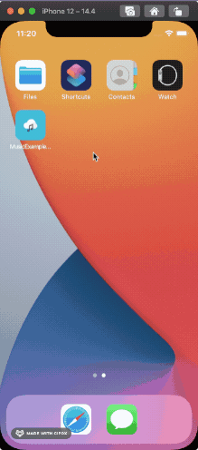

# MusicExampleApp (ReactNative)

iOS and Android music app developed via ReactNative.

### Setup
`yarn run init`

### Run
`yarn run ios` for iOS & `yarn run android` for Android

### Following areas have been covered in this app:
- Function Component approach
- React Hooks
- Unit test cases via `jest`
- Component test cases via `@testing-library/react-native`
- Navigation `wix/react-native-navigation`
